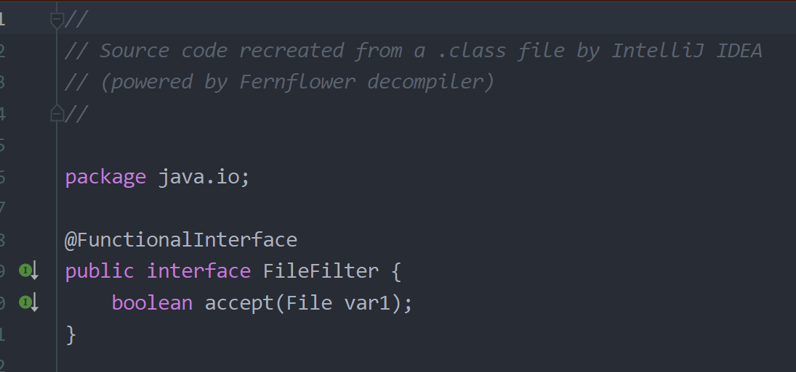

# 函数式编程小组练习 #

> - md文件编写---王庆媛

> - 思维导图编写---杨苏祥

> - 每人一份的练习函数接口demo — practice包

> - 函数式接口--郭瑞昌--filefilter包
>
>
>    使用了FileFilter接口类自带的accept方法，判断输入的目录下是否存在文件，
>返回true或false，根据返回的布尔值来判断是否输出筛选过滤出的文件格式

> - 过滤出前5个最长的单词--吴家浩--Ffith包
>   Comparator接口，用stream流的sorted排序array数组,比较array数组里字符的长度，
>用limit限制输出个数为5，最终实现从大量单词中过滤出前5个最长的单词的功能

